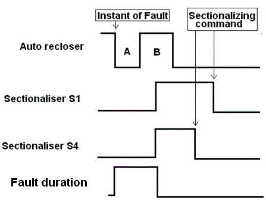
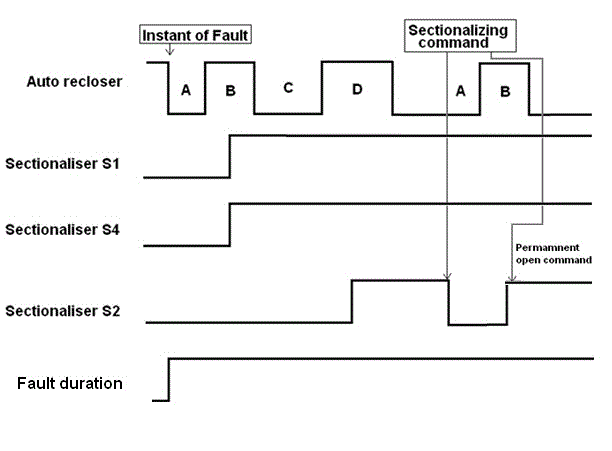

The main objectives of this demonstration is to

1. Simulate the successive operations of autorecloser and sectionaliser operations during different recloser shots.
2. To simulate the isolation of faulty section and restoring supply to the healthy sections remotely from the substation control station using sectionalisers.

We have considered the protection scheme of an 11 kV distribution feeder feeding loads at different sections as shown in Figure 1. Only four sections are considered for the ease of demonstration and the same principle can be applied to any number of sections in future. The feeder has overcurrent protection relay (R) at the substation bus end and recloser (RC) at some part of the feeder. The autorecloser operation is demonstrated by considering the settings such as curve type, plug setting, time setting for different shot curves; time delay between different shots. The settings and assumptions made in these case studies are detailed in further sections.

Figure 1: Single line diagram of the feeder configuration considered for the demonstration

<u>**1.1 Assumptions and settings**</u>  
In this section, we discuss about the assumptions made in autorecloser settings, sectionaliser settings and CT ratio.
In this example study, 11 kV distribution line with nominal rating of 6MVA / 315A (over head conductor) is considered with 5P20 class CT with ratio 400/1 A connecting the autorecloser. We assume that the faults created are three phase faults. The distribution feeder end fault current seen at the recloser is assumed to be 1.2 kA.
Autorecloser settings: The autorecloser is assumed to be set with 3 shots for phase to phase faults (example case study is shown for phase faults). Curve 1 is set to operate along definite time (DT) curve with current setting of 800A and time setting of 0.12s. Curve 2 is set to very inverse type IEC 60255 curve with pick up at 800A and Time multiplier setting (TMS) of 0.05. Curve 3 is set to follow IEC 60255 normal inverse (NI)/standard inverse (SI) characteristics with pickup at 800A and TMS of 0.1.

Operating time calculation for curve 2 settings:- VI curve settings of 800A pickup and 0.05 TMS.  
For fault at point F2:  
Fault current seen by the auto recloser is assumed to be 3.5kA. The operating time is calculated as below.  
CT ratio=400.  
Pickup =800A= 200 %.  
Therefore, plug setting factor (PS)=2.  
Plug setting Multiplier (PSM) =Fault current/plug setting factor=3500/800=4.375 (<20, hence do not saturate).  
Top= 13.5\*TMS/(PSM - 1)) =0.2s.

For fault at point F3:  
Fault current seen by the auto recloser is assumed to be 5kA. The operating time for a fault current of 5kA for very inverse curve is calculated as below.  
CT ratio=400.  
PS=800A= 200%.  
PSM=Fault current/plug setting factor =5000/800=6.25 (<20, hence do not saturate)  
Top= 13.5\*0.05/(PSM - 1)) =0.13s.

Operating time calculation for curve 3 settings:- SI curve settings of 800A pickup and 0.1 TMS.  
For fault at point F3:  
Fault current seen by the auto recloser is assumed to be 5kA. The operating time for a fault current of 5kA for very inverse curve is calculated as below.  
CT ratio=400.
PS=800A= 200%.  
PSM=Fault current/plug setting factor =5000/800=6.25 (<20, hence do not saturate)  
Top= 0.14\*TMS/(PSM^0.02 - 1)) =0.38s.

Reclosing time (time interval between the autorecloser trip and the consecutive reclosing attempt) for three autorecloser phase fault shots are 4s, 12s and 30s respectively.

Sectionaliser settings: Sectionalisers S2 and S3 thresholds/settings are set at 2 shot and 3 shot respectively. Sectionalisers S1 and S4 thresholds/settings are set at 1 shot operation. Sectionalisers are assumed to be capable of operating remotely using communication lines from substation automation control panel. Under operations of multiple sectionalisers for a particular fault, sectionalizing command signal is sent to sectionalisers with 10 sec delay between each operation form the substation automation control area.

Note: Any other sizing issues of the protective components such as CT, VT, autorecloser, sectionaliser, wiring requirements and communication requirements are assumed to be taken care off. Substation end relay settings are not presented in this module as this demonstration is mainly concentrated on autorecloser and sectionaliser operation. Autorecloser settings, sectionaliser settings considered for the illustration are example values. Practical applications of the above settings require coordination from downstream fuse curves or any other protective element.

<u>**1.2 Operating logic, Simulation and Results**</u>  
The following section describes one of the possible working/operating logic of the autorecloser and sectionaliser in conjunction with the substation automation control unit. Autorecloser are programmed for totally 3 shots for phase faults. The first shot operation is a definite time curve and the rest 2 shots are IDMT (Inverse Definite Minimum Time) curves. After every tripping, the autorecloser waits for a certain ‘dead time/ reclosing time’ before reclosing. This ‘dead time’ duration is user selectable and it is possible to have different values of dead time for different shots of recloser tripping.

If the autorecloser trips even the third time (i.e. after third shot operation), the fault is regarded as permanent. Hence further autorecloser operation is locked out. During the process of autoreclosing various sections would be removed out of the line with the help of sectionalisers to power the healthy portion of the feeder. If the fault is permanent in nature then the automation control unit can intervene the second set of autoreclosing action to reduce the number of recloser shots and command respective sectionaliser to open remotely. This section explains the simulation of autorecloser and sectionaliser operation. Data considered for the simulation are detailed in the previous sections. Three phase faults are created at different points F1 to F3 to demonstrate the autorecloser and sectionaliser operation during faults at different sections of the distribution line. The fault when assumed to be transient in nature clears during the corresponding reclosing time of the recloser shots. During permanent fault conditions, the cycle of the recloser-sectionaliser operation repeats, during such condition sectionaliser open command from the control room can be sent to prevent repetitive shots; manual inspection of the faulted section of the line needs to be done and fault is to be cleared before recharging of the feeder part.

In the following section pictorial timing outputs referred in each case study are presented. Signal high refers to the trip signal sent to breaker and low signal indicates the breaker close position for autorecloser. For sectionaliser high signal is considered open condition and low signal is considered to be closed condition. Fault duration signal refers to the time interval of persistence of the fault. Signal high refers to the fault existence and low signal refers to the fault clearing.

Case study 1: Temporary fault of 1.2 kA is at F1: Consider a temporary fault at point F1. At the instant of fault, the fault is fed from the distribution line; autorecloser pickup can be observed in the demonstration. After a definite time delay (A) autorecloser opens the circuit. The sectionalisers S1 and S4 are set to count 1 so that during the reclosing time delay (B) of the autorecloser, both the sectionalisers open. Since the fault is transient in nature, it is assumed that the fault is self cleared during the 1st reclosing time delay and power is restored by the close command to sectionalisers from substation automation control remotely. Pictorial timing output waveform is as shown below.

Where, A- time delay for 1st curve (Definite curve time delay-0.12s)  
B-reclosing time delay after 1st shot-4s,  
C-delayed operating time following curve 2 (IEC VI curve) of the recloser; for this case study operating time of 0.13s (settings file) is observed,  
D-reclosing time delay after 2nd shot-12s,  
E-delayed operating time following curve 3 (IEC SI curve) of the recloser; for this case study operating time of 0.38s (settings file) is observed,  
F-reclosing time delay after 3rd shot-30s,  
Sectionalising command for sectionaliser S3 is given after 10s delay after recloser close operation. With 10s delay on each command signal, sectionaliser S2, sectionaliser S1 and sectionaliser S4 are given close command signal.

Case study 4: Permanent fault of 1.5 kA is at F1 and cleared after manual inspection. The operation of the autorecloser and sectionaliser will be similar as discussed in case 1 (for temporary faults), but since the fault is permanent in nature, on receipt of the sectionaliser close command from the control station the sectionaliser closes the circuit. The autorecloser again picks up the fault condition and opens the circuit after definite time delay (follows DT curve-curve 1). All the recloser and sectionaliser operations are recorded in the substation automation control. Considering the sequence of operation, automation control centre can be loaded with control programs which intervene further recloser shots by giving permanent open command to S1 and a close command to S4 within the 1st reclosing time of the recloser. This logic helps to reduce the recloser operations which would in turn help in life cycle of the utility equipments. Pictorial timing output waveform is as shown below.

Where, A- time delay for 1st curve (Definite curve time delay-0.12s)  
B-reclosing time delay after 1st shot-4s,  
Sectionalising command for sectionaliser S1 is given after 10s delay after recloser close operation. Sectionaliser S1 opens again during the second time operation of the recloser. After 10s delay of recloser closer operation, sectionaliser S4 is sent the close command signal from the control station. Supply to the healthy part of the network is restored.

Case study 5: Permanent fault of 3.5 kA is at F2. At the instant of fault, the fault is fed from the distribution line; autorecloser pickup can be observed in the demonstration. After a definite time delay (A) autorecloser opens the circuit. The sectionalisers S1 and S4 are set to count 1 so that during the reclosing time delay (B) of the autorecloser, both the sectionalisers open. After the 1st reclosing time (B) the autorecloser closes the circuit. Since the fault is assumed to exist, the recloser picks up the fault current feed and operate based on the time delayed characteristics (C). Since the sectionaliser S2 count is set at 2, during the 2nd reclosing time (D) of the recloser, sectionaliser S2 open. When the autorecloser closes again the healthy line is fed with to the available loads. After time delay, sectionalising command from the control station is sent to the sectionaliser to close it remotely. Initially closing command to sectionaliser S2, since the fault is permanent in nature the reclosing procedure repeats again with the recloser operating with under definite time curve. Since there are no other sectionaliser with count loaded as 2 for this demonstration, substation control centre can intervene the recloser repetitive operations by sending the permanent open condition for S2 during the 1st reclosing time of the recloser. Pictorial timing output waveform is as shown below.

Where, A- time delay for 1st curve (Definite curve time delay-0.12s)  
B-reclosing time delay after 1st shot-4s,  
C-delayed operating time following curve 2 (IEC VI curve) of the recloser; for this case study operating time of 0.2s (settings file) is observed,  
D-reclosing time delay after 2nd shot-12s,
