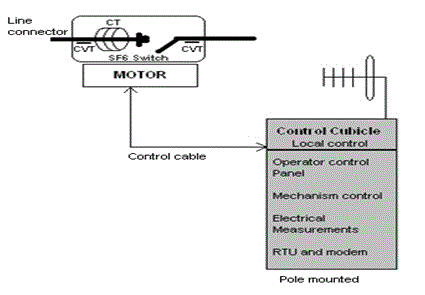
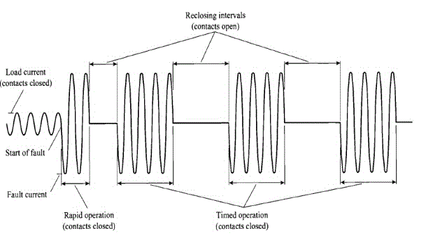

<u>**INTRODUCTION TO DISTRIBUTION PROTECTION**</u>

Distribution system is the customer end servicing point which reflects the power utility’s overall performance to the customer. The distribution network must be robust enough to handle the load uncertainties and unexpected operating scenarios. Protection of distribution feeders is important task as large load isolation due to continuous persisting fault reflects to the loss in consumption of electrical power to the consumers and hence loss of revenue to the utility. Protection system for distribution network must be capable enough to operate and isolate only the faulted system elements at the earliest possible time without affecting the remaining system to maintain reliable power to the load.

Generally utilities build ring feed network till the customer end point to ensure continuous delivery of quality power. Initially at normal conditions loads would be fed from certain source points and under certain contingency the other feed point which is normally open points (NOP) would be closed to feed power from alternate distribution feeder. These distribution feeders are protected with over current relays at substation end for phase and earth faults. Additionally, high-set element is used to clear the close-end feeder faults with lesser time delay. The high-set element also helps in preventing sympathetic tripping [3] along the multiple feeders when serving distribution loads (particularly while feeding low inertia motor loads). The distribution feeder planning process mainly concentrates on two aspects while giving connection to a new consumer. Firstly, consumer connected load should not over load the existing conductor/line and the voltage at the farthest end of the feeder should not be less that the voltage limits defined in the regulations. Also as a part of protection requirement auto-reclosers are strategically placed along the network to make sure that the far end feeder fault is sensed and recloser operates within specified time. Further, based on the criticality of load and feeder-span-sectionalisers are placed in strategic points to segregate the feeder loads. The downstream protection and source reliability issues are met through different fuses and sectionalisers along the distribution feeder. In the following sections we would discuss how the distribution protection system can be automated for better performance.

<u>**ELEMENTS OF DISTRIBUTION PROTECTION**</u>  
Generally distribution protection systems consists of

<li>Substation overcurrent relays,</li>
<li>Autoreclosers,</li>
<li>Sectionalisers,</li>
<li>Fuses.</li>

<u>**Fuses**</u>:  
Fuse is a protective device connected in series with the circuit, which melts when current passing through it exceeds a particular limit. A suitably selected fuse should open the circuit by the destruction of the fuse element, eliminate the arc established during the destruction of the element and then maintain circuit conditions open with nominal voltage applied to its terminals, (i.e. no arcing across the fuse element).
Distribution protection fuse statistics reveal that majority of fuses used operate on the expulsion principle, i.e. they have a tube to confine the arc, with the interior covered with de-ionizing fiber and a fusible element as shown in below Figure 1.

Figure 1: Expulsion type fuse

The zone of operation is limited by two factors:

1. Lower limit based on the minimum time required for the fusing of the element (minimum melting time).
2. Upper limit determined by the maximum total time that the fuse take to clear the fault (maximum clearing time).

There are many standards to classify fuses according to the rated voltages/currents, time/current characteristics, manufacturing features and other considerations. For example, there are several sections of ANSI/UL 198-1982 standards that cover low voltage fuses of 600 V or less. For medium and high voltage fuses within the range 2.3-138 kV, standards such as IEEE C37.40, 41, 42, 46, 47 and 48 apply. Other organisations and countries have their own standards; in addition, fuse manufacturers have their own classifications and designations. In distribution system applications, the use of fuse links designated K and T for fast and slow types, respectively, depending on the speed ratio, is very popular. The speed ratio is the ratio of minimum melt current that causes fuse operation at 0.1 s to the minimum melt current for 300 s operation. For the K link, a speed ratio (SR) of 6-8 is defined and SR of 10-13 for T link [1]. The T type fuses are used along the main feeder lines and K type are used at transformer linking loads. Figure 2 shows a typical 20 A K and 20 A T type fuse link time- current characteristics. We can observe discriminative operation of the fuse provided by its characteristics. The major disadvantage of the fuse is it is one time protective device. Hence fuse saving techniques under certain fault conditions are employed using autorecloser. It will be discussed further in the autorecloser section.

Figure 2: Time/ current characteristics of a) 20A K b) 20A T type fuse

<u>**Sectionalisers**</u>:  
Sectionalisers are medium/low voltage protective devices usually of single-pole type which do not have fault interrupting capabilities. It is installed downstream of a MV overhead feeder protected by a recloser/breaker. Sectionalisers count the operations of the backup device during fault conditions. Counts are registered by the sectionaliser only when fault current flow through the sectionaliser had been detected prior to the operation of the backup device. After a given number of counts, as selected as a part of the sectionaliser setting, the sectionaliser opens to isolate the faulted section of the line when the backup device is in the open position and the section of line where the sectionaliser is located is in a deenergised state. The objective of the sectionaliser to remain closed on temporary faults; the backup device will trip and reclose to restore the line to service for such faults prior to the sectionaliser opening. For permanent faults, the sectionaliser recognizes that one or more trips have occurred after the backup device reclosed, and it subsequently opens to isolate the faulted portion of the line. Modern day sectionalisers are programmed to sense the current, decide as a fault feed; the upstream protective device operation (opening) is detected by the zero current flow through it and then operates (opens). After the sectionaliser opens, the backup device automatically recloses to restore to service that portion of the line up to the sectionaliser location. Application of sectionalisers requires that the backup interrupting device be capable of detecting faults in the sectionaliser zone of protection.  
Selectivity of isolating the line section can thus be obtained by installing several sectionalisers in series on a MV feeder. The tail end sectionaliser (which is farthest from the recloser) will be opening on the first instance of current fault, then the preceding sectionaliser opening on the second occasion and so on. These devices are commonly used in North-American type distribution networks.  
Figure 3 shows a typical arrangement [11] of a remote controlled sectionaliser with various functional blocks in it. The sectionaliser control cubicle which can be placed on the pole would be having the local control and remote control equipments. The electrical measurements, mechanism control, RTU and modem can be accessed remotely which are within the control cubicle. The motor driven SF6 switch along with antenna and various instrument transformers will be placed along at the top of the distribution pole.

Figure 3: Blocks of a remote controlled sectionaliser

Sectionalisers can be operated remotely using different communication lines. Figure 4 shows a typical remote controlled sectionaliser [11] which can be interfaced with substation automation control center/ SCADA.

Figure 4: MV distribution sectionaliser and control box.

<u>**Autorecloser**</u>:  
Autorecloser is a protective device with the ability to detect phase and phase-to-earth overcurrent conditions, to interrupt the circuit if the overcurrent persists after a predetermined time, and then to automatically reclose to re-energise the line. If the fault that originated the operation still exists, then the recloser will stay open after preset number of operations, thus isolating the faulted section from the rest of the system. In an overhead distribution system between 80 to 95 per cent of the faults are of a temporary nature and last, at the most, for a few cycles or seconds [1]. Thus, the recloser, with its opening/closing characteristic, prevents a distribution circuit being left out of service for temporary faults. Typically, reclosers are designed to have up to three open-close operations and after these a final open operation to lock out the sequence. The counting mechanisms register operations of the phase or earth-fault units which can also be initiated by externally controlled devices when appropriate communication means are available. The operating time/current characteristic curves of reclosers normally incorporate three-four curves based on the number of shots, one fast (Definite time, extreme inverse (EI) or very inverse curves (VI)) and further delayed curves (coordinated normal inverse (NI) or user defined IDMT curves). Most of the modern reclosers give flexibility for the programmers to either program IEC 60255, ANSI/IEEE C37.112 or any user defined time current characteristics. Curve settings, recloser settings and number of recloser shots can be set different for phase and earth faults. This allows reprogramming of the characteristics to tailor an arrangement to a customer's specific needs without the need to change components. Co-ordination with other protection devices is important in order to ensure that when a fault occurs, the smallest section of the circuit is disconnected to minimize disruption of supplies to customers. Generally, the time characteristic and the sequence of operation of the recloser are selected to co-ordinate with mechanisms upstream towards the source. After selecting the size and sequence of operation of the recloser, the devices downstream are adjusted in order to achieve correct co-ordination. Autoreclosers are used to apply fuse saving schemes in distribution lines under transient fault conditions with the help of fast curves. Further numerical autoreclosers are programmed to detect under voltage, under frequency, live line protections. Directional elements can be enabled for ring type feeders. Autoreclosers needs to be set with cold load pickup and inrush restraint settings for better sensitivity.  
A typical sequence of a recloser operation for a permanent fault is shown in Figure 5.

Figure 5: Sequence of recloser operations

Autorecloser instrument transformers continuously monitor all the phase currents, voltages, neutral current (using earth current sensitive CTs) and frequency. Whenever fault is identified, first shot is carried out in instantaneous mode to clear temporary faults before they cause damage to the lines. This can be achieved using definite time characteristics, EI or VI curves during high fault currents. Since it is known that most of the distribution feeder faults are transient in nature, the instantaneous mode of recloser operation helps in saving the downstream fuses during temporary faults. If the fault is cleared during the first recloser time delay (first dead time delay), after the reclosing, the fuse would observe normal load current thus saving the fuse blow. The later shots operate on time delayed curve which are set based on the coordination (discrimination time delay) of fuse/recloser whichever is present downstream and upstream of the autorecloser. If the fault is permanent, the time-delay operation allows other protection devices nearer to the fault to open (sectionalisers / fuses), limiting the amount of the network being disconnected. Earth faults are less severe and more in number than phase faults and, therefore, it is important that the recloser has an appropriate sensitivity to detect them. One method is to use CTs connected residually so that the resultant residual current under normal conditions is approximately zero under perfectly balanced loading condition; however the settings are set considering the probable unbalance condition in the feeder load. The other method of detection is using core balanced CTs to detect most sensitive earth faults. The recloser should operate when the residual current exceeds the setting value, as would occur during earth faults.  
Single-phase reclosers are used when the load is predominantly single-phase. In such a case, when a single-phase fault occurs the recloser should permanently disconnect the faulted phase so that supplies are maintained on the other phases. Three-phase reclosers are generally recommended to avoid single-phasing of three-phase motors and potential ferroresonance [2]. Reclosers are fitted with breakers operating on either hydraulic or electronic type operating mechanisms. Reclosers with hydraulic operating mechanisms have a disconnecting coil in series with the line. When the current exceeds the setting value, the coil attracts a piston that opens the recloser main contacts and interrupts the circuit. The time characteristic and operating sequence of the recloser are dependent on the flow of oil in different chambers. The electronic type of control mechanism is normally located outside the recloser and receives current signals from a CT-type bushing. When the current exceeds the predetermined setting, a delayed shot is initiated that finally results in a tripping signal being transmitted to the recloser control mechanism. The control circuit determines the subsequent opening and closing of the mechanism, depending on its setting. Reclosers with electronic operating mechanisms use a coil or motor mechanism to close the contacts. Vacuum and SF6 reclosers have the advantage of requiring less maintenance. The electronic control also provides a wide range of accessory enhancements to meet the specific needs of the user. Reclosers are designed to use either oil or vacuum as the interrupting medium. Their operators are magnetic, so that they are rated for many more operations than traditional oil-type reclosers. Reclosers are used because their cost is generally less than conventional breakers and separate relays. Figure 6 shows the internal structure of a typical vacuum interrupter autoreclosers [12]. It can be observed that facility of local mechanical pullout switch to bypass the complete recloser operations.

Figure 6: Internal structure of Autorecloser [12]

When installing reclosers it is necessary to take into account the following factors:

<ul style="list-style-type: disc">
<li>System voltage.</li>
<li>Short-circuit level.</li>
<li>Maximum load current.</li>
<li>Minimum short-circuit current within the zone to <li>be protected by the recloser.</li>
<li>Co-ordination with other mechanisms located upstream towards the source and downstream towards the load.</li>
<li>Sensitivity of operation for earth faults.</li>
</ul>

The voltage rating and the short-circuit capacity of the recloser should be equal to or greater than, the values that exist at the point of installation. The same criteria should be applied to the current capability of the recloser in respect of the maximum load current to be carried by the circuit. It is also necessary to ensure that the fault current at the end of the line being protected is high enough to cause operation of the recloser. Since autoreclosers are used at distribution feeders, care must be taken for restraining cold load pickup [10] and magnetizing inrush currents [10] of the downstream transformers. Figure 7 shows the picture of a pole mounted autorecloser [12] with control cubicle.

Figure 7: Distribution pole mounted autorecloser

<u>**DISTRIBUTION PROTECTION AUTOMATION AND CONTROL**</u>  
Distribution protection automation requires huge data compilation when compared to transmission network automation. This is because of large number of load details, their connected phase if single phase loads, different line and cable type data along the line till the last load point, protection elements along the complete line including the type and fuse location, settings involved in different protection elements, normal open points and positions of such points (RMUs) along the feeder.

Distribution protection automation refers to inter linking the protection elements along the line with the control center so that data and command/request signal exchange can be done between the elements. Local control center can be arranged in the substation for all the feeders emanating from the substation. Further one more level of automation control can be arranged in the vicinity of the distribution company which has higher control authority for all the substations. Distributed topology has better performance than the centralized topology in terms of automation architecture [6]. In hardware implementation side, RTU based topology [6] along with decentralized topology of ring connection of bay modules are well appreciated in the industry.

For interlinking different elements of protection automation equipments suitable communication can be established between them. Digital communication is divided into three main elements. They are

1. The protocol, consisting of the hardware, such as connectors, connector pin functions, and signal ,
2. The format, consisting of the control of the flow of data,
3. The language or how the information in the data flow is organised.

During the early evolution of automation control, manufacturers of the automation communication equipments developed proprietary protocols so that the user need to buy the complete set of equipments with the same manufacturer. Protocols were also dependent on the number of conductors used and the format of data transfer (serial or parallel). Considering the advantages of serial communication over parallel communication over long runs, there are many popular serial communication protocols. Few of them are:

1. RS232C protocol
2. RS485 protocol
3. IEC 60870-5 protocol

The most common protocols in use conform to the International standard organization 7 (ISO 7) layer model of a network. This model is internationally recognised as the standard for the requirements for communications between data processing systems.

A recent protocol, the Utility Communications Architecture v2.0 (UCA v2.0), seeks to overcome these handicaps by adopting an object-oriented approach to the data held in a measurement/control device, plus an internationally recognised protocol (ISO 9506) in the application layer. Data objects and services available within a device follow a specified naming system. The client can extract a description of the data objects that a device can supply, and services that it can perform, so that it is easier to program the client. Scaling factors and units for data items are built into the self-description, so that the effort required during commissioning is reduced. Devices are not interchangeable, in the sense that a device from one manufacturer cannot be removed and replaced by a device of similar functionality from another vendor. Rather, this protocol ensures interoperability; that is the ability for devices from different suppliers and of different functionality to communicate successfully with each other. The transport protocol has been separated from the application protocol, so problems with register addresses, etc. no longer exist. All that has to be addressed is the transport protocols used, and clients will normally be able to communicate with devices using one of a number of common transport protocols. This standard has an IEC equivalent, IEC 61850. To begin with, IEC 61850 covers only the field of substation automation, but will gradually be extended to cover the same fields as UCA v2.0. Manufacturers are increasingly moving away from protocols with a proprietary element in them to UCA v2.0/IEC 61850. It is likely that within a short time, most protection and control devices will use one or other of these standards for communications. One important reason guiding this change is that these standards permit the use of the XML language for exchange of data between databases. As the information stored in an automation system or control centre comprises a series of databases, information exchange is therefore facilitated.
Also, it is to be noted that testing of the automation equipments needs to be done at different levels and a self diagnostic program needs to be always ready to run and detect the faulty operations within the automation control equipments.

Many programs can be loaded with the control centre for better usage of the system equipments. Since most of the protection equipments have metering facility, load data can be precisely monitored and recorded for feeder load analysis. With the help of load details at feeder level, electricity theft details, feeder wise billing and collection data, area wise load pattern for the time of day, cost of serving different area/consumer categories can be analyzed and calculated. These data would help the utility to optimize the revenue collection. Further by maintaining the precise database of different equipment failures, different manufacturer can be rated based on the onsite service of the equipments. Since the loads can be monitored and controlled at very high sensitive readings i.e.at sectionaliser level, load shedding because of under frequency or based on the quality of load served can be done remotely.
